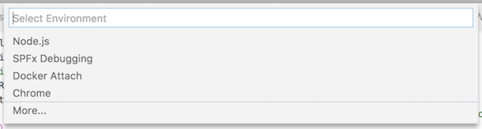
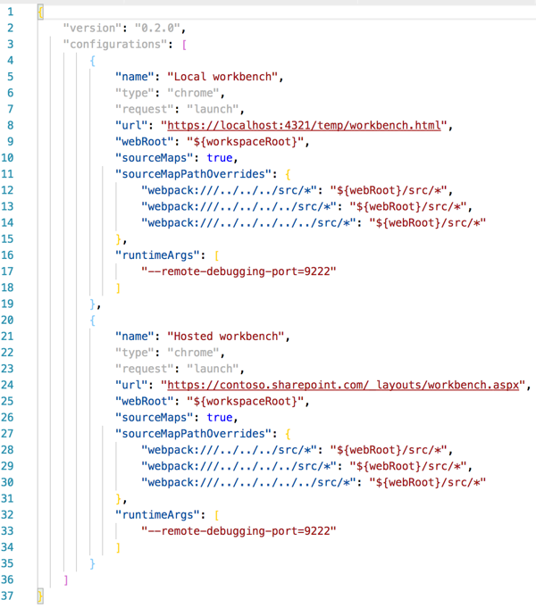
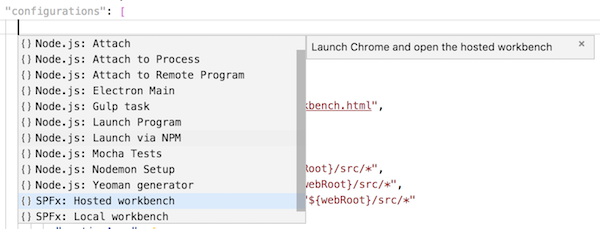

# SharePoint Framework - Visual Studio Code Debug Configuration Extension

This Visual Studio Code extension can be used to add the required configuration for debugging your SharePoint Framework.

## Why this project?

When you want to debug your SharePoint Framework solutions, it requires a bit of configuration in order to get it working. With this extension you can automatically add the right debugging configuration.

The extension contains the configuration for the local and hosted workbench.

When you already have configured something in the `launch.json` file, you can always add these configurations afterwards by clicking on **add configuration** and choosing the one you need:

## Changes

You can check the [change log](./CHANGELOG.md) to get an overview of all the changes made to this extension.